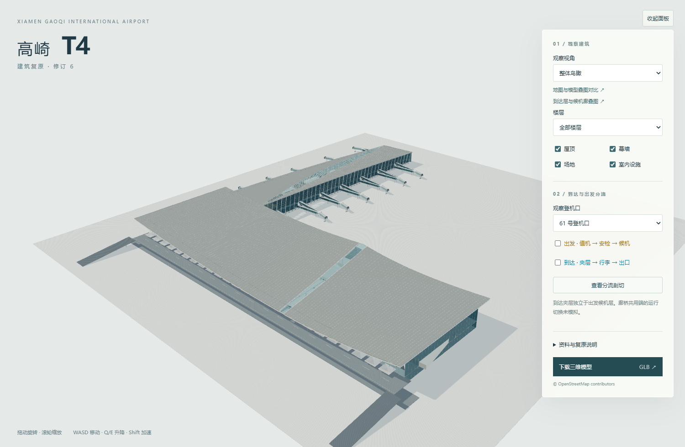

# 厦门高崎 T4 航站楼复原

[在线三维模型](https://duter646.github.io/xiamen-gaoqi-t4-model/) · [出发大厅叠图](https://duter646.github.io/xiamen-gaoqi-t4-model/compare.html) · [到达层与候机廊叠图](https://duter646.github.io/xiamen-gaoqi-t4-model/arrival-finger-compare.html)



交互网页与可下载 GLB，包含主楼、曲面屋顶、候机指廊、廊桥、独立到达夹层、主要公共室内及到达／出发动线。当前为建筑修订 6，首次加载模型约 23.4 MB。模型不是测绘成果，局部采用推断；依据与剩余偏差见 [证据记录](EVIDENCE.md) 和 [检查报告](REPORT.md)。

## 浏览与下载

鼠标拖动旋转、滚轮缩放；WASD 移动、Q/E 升降、Shift 加速。侧栏可切换视角、楼层、屋顶、幕墙，并按 12 个登机口查看动线。相机自由浏览，不是机场导航系统。

两个叠图页面支持地图与实际模型投影对照、修改前后切换及透明度调节。

GLB 不纳入 Git，从 [Release v1.0.0](https://github.com/duter646/xiamen-gaoqi-t4-model/releases/tag/v1.0.0) 下载后放入 `assets/xiamen-gaoqi-t4.glb`；网页也可直接下载。校验值见 `SHA256SUMS.txt`。

## 本地预览与重建

运行 `./start_preview.ps1`，打开 http://127.0.0.1:8767/ 。不能以 file:// 直接加载模型。

重建需要 Python、NumPy 和 Pillow：

```powershell
python source/build.py
python tests/geometry_check.py
python tests/map_check.py
```

浏览器检查使用 Playwright 与 Edge；现有检查脚本运行时路径按本机配置，换机器需调整。叠图历史模型保存在本地 `archive/`，不随仓库分发；最终叠图已包含在 `assets/`，运行网页无需历史模型。

## GitHub Pages 发布

沿用 T3：独立公开源码仓库＋Release 模型＋GitHub Actions Pages。工作流下载指定 Release 模型、校验 SHA-256，再组装网站。推送 main 或手动触发工作流即可发布。

- `source/`：模型源码、参数、描线坐标。
- `assets/`：动线、纹理及叠图交付文件。
- `references/`：仅本地保存的原始参考与来源记录，不上传公开仓库或 Pages。
- `tests/`：持续检查脚本、验收结果和截图。
- `tools/assemble_site.py`：发布文件清单。
- `archive/`：仅本地保留的历史版本和清理归档，Git 忽略。

OSM 数据 © OpenStreetMap contributors，适用 ODbL；Three.js 使用 MIT License。参考图片保留原作者权利，见 `THIRD_PARTY_NOTICES.txt` 与资料索引；参考照片未作为 GLB 贴图。
